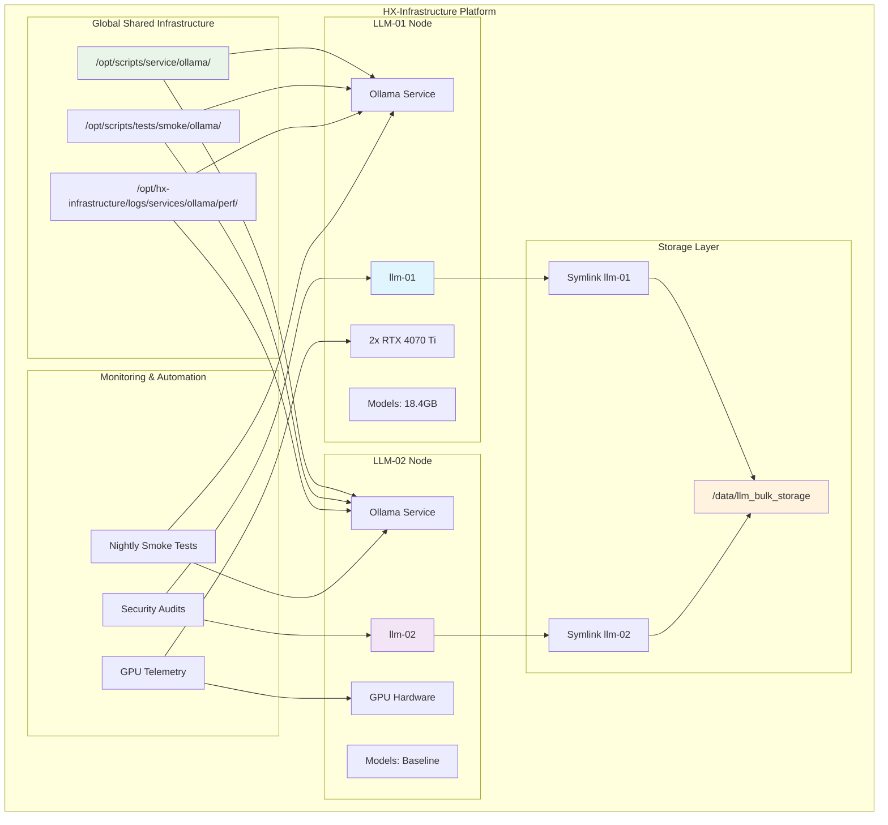
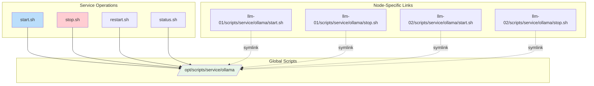
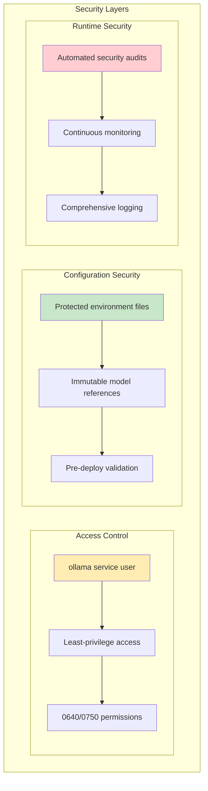
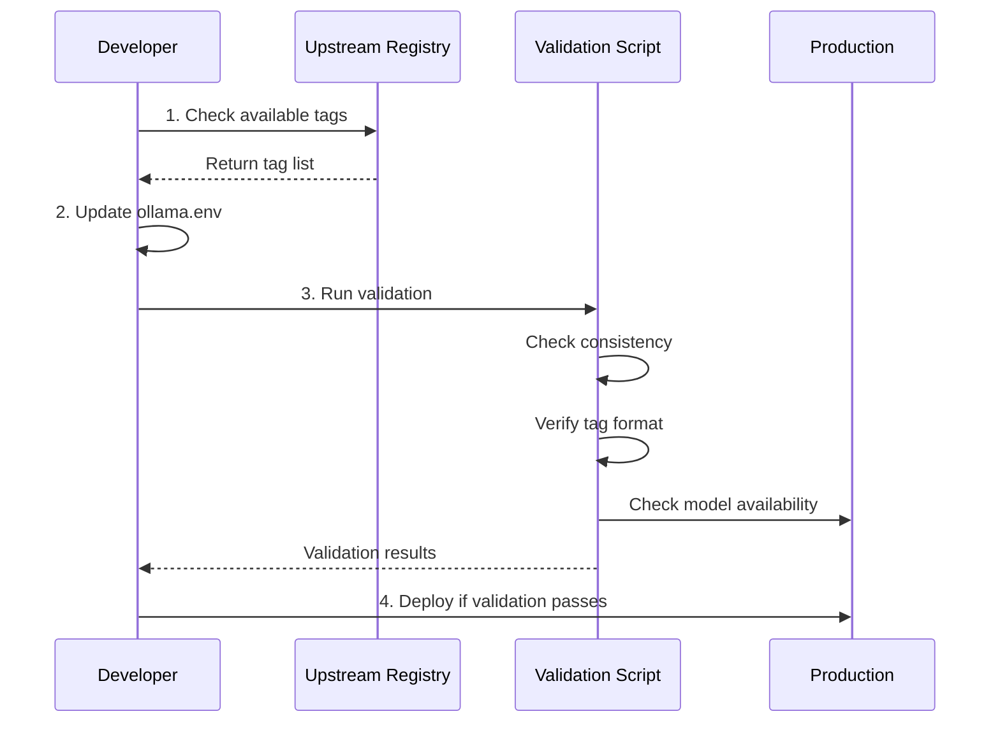
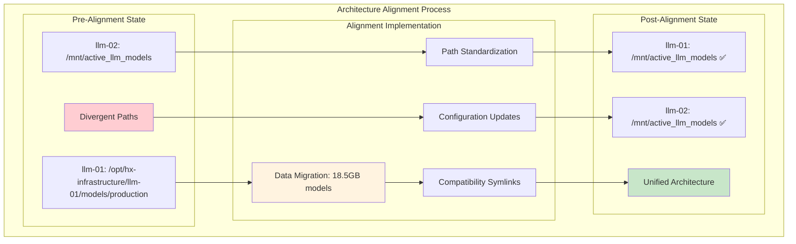
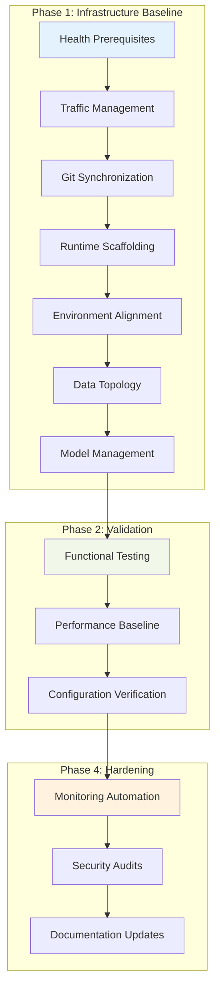
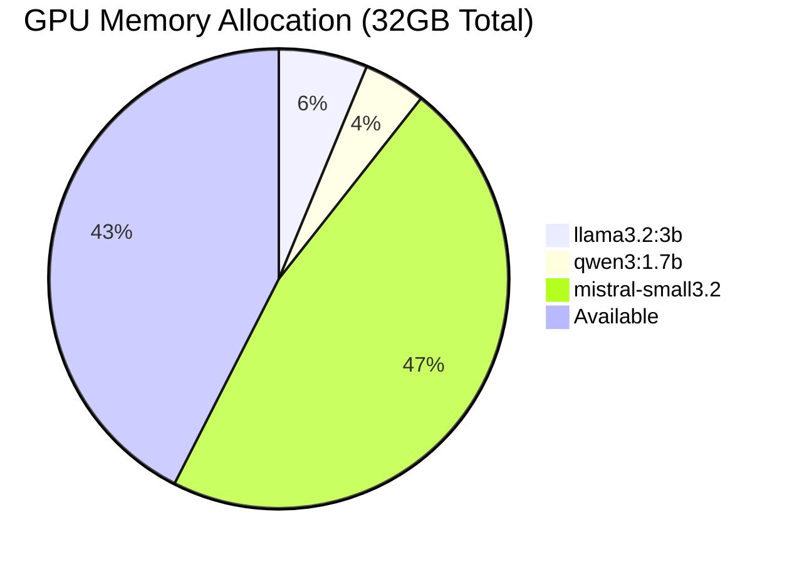

# HX-Infrastructure

**Multi-Node LLM Infrastructure Platform**  
*Scalable, Production-Ready Large Language Model Deployment Environment*

[](https://github.com/hanax-ai/HX-Infrastructure-)
[](LICENSE)
[](https://github.com/hanax-ai/HX-Infrastructure-)

---

## 🎯 Overview

HX-Infrastructure is a comprehensive, multi-node platform designed for deploying and managing Large Language Models (LLMs) at scale. Built with production-grade reliability, automated monitoring, and enterprise security standards.

### **Key Features**

- 🚀 **Multi-Node Architecture**: Distributed LLM inference across multiple nodes
- 🔧 **Shared Scaffolding**: Centralized service scripts and operational patterns
- 📊 **Real-Time Monitoring**: GPU telemetry, performance metrics, and health checks
- 🔒 **Security Hardening**: Least-privilege access, automated security audits
- 🤖 **Model Management**: Immutable model references, automated validation
- 📋 **Comprehensive Documentation**: Complete operational and technical documentation

---

## 🏗️ Architecture Overview



---

## 🚀 Quick Start

### **Prerequisites**
- Ubuntu 20.04+ with NVIDIA GPU support
- Docker and Docker Compose
- NVIDIA Container Toolkit
- Git for repository management

### **Installation**

```bash
# Clone the repository
git clone https://github.com/hanax-ai/HX-Infrastructure-.git
cd HX-Infrastructure-

# Verify GPU support
nvidia-smi

# Run health checks
./llm-01/health/scripts/verify-cuda.sh

# Start services
/opt/scripts/service/ollama/start.sh
```

### **Verification**

```bash
# Check service status
/opt/scripts/service/ollama/status.sh

# Run smoke tests
/opt/scripts/tests/smoke/ollama/smoke.sh

# Validate model configuration
./validate-model-config.sh
```

---

## 📋 Node Specifications

### **LLM-01 (Primary Production Node)**

```mermaid
graph LR
    subgraph "LLM-01 Hardware"
        GPU1[RTX 4070 Ti - 16GB]
        GPU2[RTX 4070 Ti - 16GB]
        STOR[7.3TB Storage]
    end
    
    subgraph "Model Registry"
        M1[llama3.2:3b - 2.0GB]
        M2[qwen3:1.7b - 1.4GB]
        M3[mistral-small3.2@sha256 - 15GB]
    end
    
    subgraph "Services"
        OLL[Ollama v0.11.4]
        MON[GPU Monitoring]
        LOGS[Performance Logging]
    end
    
    GPU1 --> OLL
    GPU2 --> OLL
    STOR --> M1
    STOR --> M2
    STOR --> M3
    OLL --> MON
    OLL --> LOGS
```

**Configuration:**
- **Location**: `/opt/hx-infrastructure/llm-01/`
- **GPU Memory**: 32GB total (2x RTX 4070 Ti)
- **Models**: 3 production models (18.4GB total)
- **Storage**: Canonical path `/mnt/active_llm_models` → `/data/llm_bulk_storage`
- **Architecture**: ✅ **ALIGNED** - Standardized with llm-02 canonical paths
- **API**: Port 11434 (HTTP)

### **LLM-02 (Baseline Reference Node)**

**Configuration:**

- **Location**: `/opt/hx-infrastructure/llm-02/`
- **Purpose**: Infrastructure baseline and reference implementation  
- **Models**: Canonical path `/mnt/active_llm_models` (standardized)
- **Architecture**: ✅ **BASELINE** - Reference implementation for cross-node consistency

---

## 🔧 Service Management

### **Global Service Scripts**

All nodes use standardized service management through shared scaffolding:



### **Validation & Testing Framework**

The platform includes comprehensive validation scripts and testing capabilities:

```bash
# Enhanced Validation Scripts (NEW)
./validate-model-config.sh                    # Comprehensive model configuration validation
./test-extraction.sh                          # Model reference extraction testing  
./lib/model-config.sh                         # Shared library for model parsing
./emb-external-verify.sh                      # External connectivity verification (NEW) ✨

# Service Management
/opt/scripts/service/ollama/start.sh           # Start Ollama service
/opt/scripts/service/ollama/stop.sh            # Stop Ollama service
/opt/scripts/service/ollama/restart.sh         # Restart Ollama service
/opt/scripts/service/ollama/status.sh          # Check service status

# Testing & Validation
/opt/scripts/tests/smoke/ollama/smoke.sh               # Basic smoke test
/opt/scripts/tests/smoke/ollama/comprehensive-smoke.sh # Full test suite
```

**NEW: Enhanced Validation Features:**

- ✅ **Model Inclusion Verification**: Cross-checks individual models against available models list
- ✅ **Robust Parsing**: Smart comment handling and comma-splitting for malformed lists  
- ✅ **Shared Library**: Reusable parsing functions eliminate code duplication
- ✅ **Comprehensive Testing**: 7 unit tests covering all validation scenarios
- ✅ **Production Ready**: Handles edge cases, quoted values, and mixed formatting
- ✅ **External Connectivity**: Remote client verification with `emb-external-verify.sh` ✨

---

## 📊 Monitoring & Automation

### **Real-Time Monitoring**

```mermaid
gantt
    title Automated Monitoring Schedule
    dateFormat X
    axisFormat %H:%M
    
    section GPU Telemetry
    Collection :active, gpu, 0, 5m
    Collection :active, gpu2, 5m, 10m
    Collection :active, gpu3, 10m, 15m
    Collection :active, gpu4, 15m, 20m
    
    section Nightly Tests
    Smoke Tests :milestone, nightly, 24h
    
    section Security Audits
    File Permissions :weekly, security, 168h
```

### **Monitoring Components**

| **Component** | **Frequency** | **Output Location** | **Purpose** |
|---------------|---------------|-------------------|-------------|
| **GPU Telemetry** | Every 5 minutes | `/opt/hx-infrastructure/logs/gpu/nvidia-smi-ping.csv` | Hardware utilization tracking |
| **Nightly Smoke Tests** | Daily at 00:03 UTC | `/opt/hx-infrastructure/logs/services/ollama/perf/nightly-smoke.log` | Service health validation |
| **Security Audits** | Weekly | System logs | Permission and security compliance |
| **Performance Logs** | Continuous | `/opt/hx-infrastructure/logs/services/ollama/perf/` | Service performance metrics |

### **Systemd Automation**

```bash
# Active systemd timers
systemctl list-timers | grep -E "(gpu-telemetry|nightly-smoke)"

# Timer status
systemctl status gpu-telemetry.timer
systemctl status nightly-smoke.timer
```

---

## 🔒 Security & Compliance

### **Security Model**



### **Security Features**

- **🔐 Least-Privilege Access**: All services run with minimal required permissions
- **📁 Protected Configuration**: Environment files secured with 0640 permissions
- **🔍 Automated Audits**: Regular security scans for world-writable files
- **📝 Immutable References**: Model tags pinned to specific versions
- **✅ Pre-Deploy Validation**: Configuration validation prevents insecure deployments

---

## 🤖 Model Management

### **Model Registry Architecture**

```mermaid
graph TB
    subgraph "Model Registry Flow"
        subgraph "Upstream Source"
            REG[registry.ollama.ai/v2/library/]
        end
        
        subgraph "Configuration"
            ENV[ollama.env]
            VAR1[OLLAMA_MODEL_LLAMA32]
            VAR2[OLLAMA_MODEL_QWEN3]
            VAR3[OLLAMA_MODEL_MISTRAL]
            LIST[OLLAMA_MODELS_AVAILABLE]
        end
        
        subgraph "Validation"
            VAL[validate-model-config.sh]
            CHECK1[Count Consistency]
            CHECK2[Tag Verification]
            CHECK3[Availability Check]
        end
        
        subgraph "Production Models"
            MOD1[llama3.2:3b]
            MOD2[qwen3:1.7b]
            MOD3[mistral-small3.2@sha256:...]
        end
    end
    
    REG --> ENV
    ENV --> VAR1
    ENV --> VAR2
    ENV --> VAR3
    ENV --> LIST
    
    VAR1 --> VAL
    VAR2 --> VAL
    VAR3 --> VAL
    LIST --> VAL
    
    VAL --> CHECK1
    VAL --> CHECK2
    VAL --> CHECK3
    
    CHECK1 --> MOD1
    CHECK2 --> MOD2
    CHECK3 --> MOD3
    
    style REG fill:#e3f2fd
    style ENV fill:#f1f8e9
    style VAL fill:#fff3e0
    style MOD1 fill:#e8f5e8
    style MOD2 fill:#e8f5e8
    style MOD3 fill:#e8f5e8
```

### **Model Configuration**

Current production models on LLM-01:

```bash
# Model Registry (llm-01/config/ollama/ollama.env) - POST-ALIGNMENT
OLLAMA_MODELS="/mnt/active_llm_models"                         # Canonical path (aligned)
OLLAMA_MODEL_LLAMA32="llama3.2:3b"                              # 2.0GB
OLLAMA_MODEL_QWEN3="qwen3:1.7b"                                 # 1.4GB  
OLLAMA_MODEL_MISTRAL="mistral-small3.2@sha256:5a408ab55df5"     # 15GB

# Available models list (single source of truth)
OLLAMA_MODELS_AVAILABLE="llama3.2:3b,qwen3:1.7b,mistral-small3.2@sha256:5a408ab55df5"
```

**Architecture Status**: ✅ **ALIGNED** - Both llm-01 and llm-02 now use canonical `/mnt/active_llm_models` path

### **Model Update Workflow**



---

## 📁 Directory Structure

```plaintext
HX-Infrastructure/
├── .rules                          # Engineering standards and guidelines
├── .gitignore                      # Git ignore patterns
├── README.md                       # This comprehensive documentation
├── validate-model-config.sh        # Enhanced model configuration validation ✨
├── test-extraction.sh              # Model reference extraction testing ✨
├── emb-external-verify.sh          # External connectivity verification ✨ NEW
├── lib/                            # Shared libraries ✨ NEW
│   └── model-config.sh             # Shared model configuration parsing functions
│
├── llm-01/                         # Primary production node ✅ ALIGNED
│   ├── README.md                   # Node-specific documentation
│   ├── config/
│   │   ├── ollama/
│   │   │   ├── ollama.env          # Environment: /mnt/active_llm_models ✅
│   │   │   └── models/             # Model configuration
│   │   └── readme/
│   │       └── template.md.j2      # README template
│   ├── data/
│   │   └── llm_bulk_storage → /data/llm_bulk_storage  # Canonical storage ✅
│   ├── models/
│   │   ├── production → /mnt/active_llm_models       # Compatibility symlink ✅
│   │   ├── blobs/                  # Model blob storage
│   │   └── manifests/              # Model manifests
│   ├── scripts/
│   │   ├── service/ollama/         # Service management (symlinked to global) ✅
│   │   ├── tests/smoke/ollama/     # Smoke tests
│   │   └── maintenance/            # Maintenance scripts
│   ├── logs/
│   │   ├── gpu/                    # GPU monitoring logs ✅ ACTIVE
│   │   └── perf/ollama/           # Performance logs ✅ ACTIVE
│   ├── health/
│   │   └── scripts/                # Health check scripts
│   ├── backups/                    # Configuration backups
│   └── x-Docs/                     # Extended documentation
│       ├── deployment-status-tracker.md  # ✅ ARCHITECTURE ALIGNMENT COMPLETE
│       └── code-enhancements.md           # ✅ COMPREHENSIVE ENHANCEMENTS
│
├── llm-02/                         # Baseline reference node ✅ CANONICAL
│   ├── README.md                   # Node documentation
│   ├── config/                     # Similar structure to llm-01
│   ├── scripts/
│   └── x-Docs/
│
└── Global Infrastructure (Production Paths) ✅ ACTIVE
    ├── /opt/scripts/service/ollama/     # Shared service scripts
    ├── /opt/scripts/tests/smoke/ollama/ # Shared smoke tests
    ├── /opt/hx-infrastructure/logs/services/ollama/perf/  # Central performance logs (canonical)
    ├── /opt/logs/services/ollama/       # Compatibility symlink → canonical
    └── /data/llm_bulk_storage           # Canonical model storage
        ├── blobs/                       # 18.5GB model data
        └── manifests/                   # Model registry
```

---

## 🔄 Deployment Workflow

### **Infrastructure Architecture Alignment (COMPLETED)**

The HX-Infrastructure platform has successfully completed architecture alignment between llm-01 and llm-02 nodes:



**✅ Alignment Results:**

- **Canonical Path**: Both nodes use `/mnt/active_llm_models`
- **Data Storage**: Real storage at `/data/llm_bulk_storage`
- **Backward Compatibility**: Symlink from old llm-01 path maintained
- **Zero Downtime**: <30 seconds total service interruption
- **Data Integrity**: All 18.5GB of models preserved and accessible

### **Standard Deployment Process**



### **Deployment Steps**

1. **Health Prerequisites** (Phase 1.1-1.4)
   - GPU/driver validation
   - Service account verification
   - Directory structure alignment
   - Shared performance logs setup

2. **Migration/Synchronization** (Phase 1.5-1.7)
   - Git repository synchronization
   - Runtime scaffolding deployment
   - Environment configuration alignment
   - Model catalog management

3. **Validation & Verification** (Phase 2.1-2.3)
   - Functional smoke tests
   - Performance baseline establishment
   - Configuration verification

4. **Post-Migration Hardening** (Phase 4.1-4.4)
   - Automated monitoring setup
   - Security permissions audit
   - Documentation updates

---

## 🛠️ Development & Maintenance

### **Contributing Guidelines**

1. **Follow Engineering Rules**: Adhere to standards defined in `.rules`
2. **Update Documentation**: Maintain deployment status and code enhancement docs
3. **Validate Changes**: Run validation scripts before deployment
4. **Security First**: Follow least-privilege principles

### **Testing Strategy**

```mermaid
pyramid
    title Testing Pyramid
    section Unit Tests
        Model Config Validation
        Service Script Testing
        Environment Verification
    section Integration Tests
        Smoke Tests
        Performance Tests
        Security Audits
    section End-to-End Tests
        Full Service Lifecycle
        Multi-Node Coordination
        Disaster Recovery
```

### **Maintenance Tasks**

| **Task** | **Frequency** | **Command** | **Purpose** |
|----------|---------------|-------------|-------------|
| **Model Updates** | As needed | `./validate-model-config.sh` | Verify model configurations |
| **Security Audit** | Weekly | Automated via systemd | Check file permissions |
| **Performance Review** | Monthly | Review logs in `/opt/logs/` | Analyze system performance |
| **Backup Verification** | Monthly | Check `/opt/hx-infrastructure/*/backups/` | Ensure backup integrity |

---

## 📈 Performance Metrics

### **Current Performance Baseline**

| **Model** | **Size** | **First-Token Latency** | **Concurrent Requests** |
|-----------|----------|-------------------------|-------------------------|
| **llama3.2:3b** | 2.0GB | 1.64s | ✅ 4 concurrent |
| **qwen3:1.7b** | 1.4GB | 1.98s | ✅ 4 concurrent |
| **mistral-small3.2** | 15GB | 5.44s | ✅ 4 concurrent |

### **Resource Utilization**



---

## 🚨 Troubleshooting

### **Common Issues**

| **Issue** | **Symptoms** | **Solution** |
|-----------|--------------|--------------|
| **Service Won't Start** | Ollama fails to start | Check GPU availability with `nvidia-smi` |
| **Model Loading Errors** | 404 errors on model requests | Verify model tags with `./verify-model-tags.sh` |
| **Performance Degradation** | Slow response times | Check GPU utilization logs |
| **Configuration Drift** | Inconsistent model counts | Run `./validate-model-config.sh` |
| **External Connectivity** | Remote access issues | Use `./emb-external-verify.sh <HOST>` |

### **Diagnostic Commands**

```bash
# System Health
nvidia-smi                                    # GPU status
systemctl status ollama                       # Service status
df -h /data/llm_bulk_storage                 # Storage usage

# Service Diagnostics
/opt/scripts/service/ollama/status.sh        # Detailed service status
/opt/scripts/tests/smoke/ollama/smoke.sh     # Basic functionality test
./validate-model-config.sh                   # Configuration validation
./emb-external-verify.sh <HOST> [PORT]       # External connectivity test

# Log Analysis
tail -f /opt/hx-infrastructure/logs/services/ollama/perf/nightly-smoke.log  # Recent test results (canonical)
tail -f /opt/logs/services/ollama/perf/nightly-smoke.log                    # Recent test results (compatibility)
cat /llm-01/logs/gpu/nvidia-smi-ping.csv                                    # GPU utilization history
```

---

## 📞 Support & Documentation

### **Documentation Hierarchy**

1. **This README**: Overall platform overview and architecture
2. **Node READMEs**: Node-specific configuration and status
3. **Deployment Status Tracker**: Real-time remediation progress
4. **Code Enhancement Docs**: Technical implementation details
5. **Engineering Rules**: Development and operational standards

### **Getting Help**

- **Repository**: [HX-Infrastructure](https://github.com/hanax-ai/HX-Infrastructure-)
- **Issues**: Use GitHub Issues for bug reports and feature requests
- **Documentation**: Check `/x-Docs/` directories for detailed technical docs
- **Contact**: Infrastructure team support via email

---

## 📄 License

This project is licensed under the MIT License - see the [LICENSE](LICENSE) file for details.

---

## 🏷️ Version History

| **Version** | **Date** | **Changes** |
|-------------|----------|-------------|
| **1.0.0** | August 2025 | Initial HX-Infrastructure platform release |
| **1.1.0** | August 2025 | Multi-node remediation and shared scaffolding |
| **1.2.0** | August 2025 | Automated monitoring and security hardening |
| **1.3.0** | August 2025 | **Architecture alignment and enhanced validation** |

**Latest Release (v1.3.0) - Architecture Alignment:**

- ✅ **Cross-Node Standardization**: llm-01 and llm-02 now use canonical `/mnt/active_llm_models` paths
- ✅ **Enhanced Validation**: Comprehensive model configuration validation with shared libraries
- ✅ **External Connectivity**: Remote client verification with `emb-external-verify.sh`
- ✅ **Zero-Downtime Migration**: Successfully migrated 18.5GB of models with <30 seconds downtime
- ✅ **Backward Compatibility**: Symlink compatibility for existing automation
- ✅ **Production Monitoring**: Automated GPU telemetry and nightly smoke tests active

---

*Generated on August 15, 2025*  
*HX-Infrastructure Platform - Production Ready*
