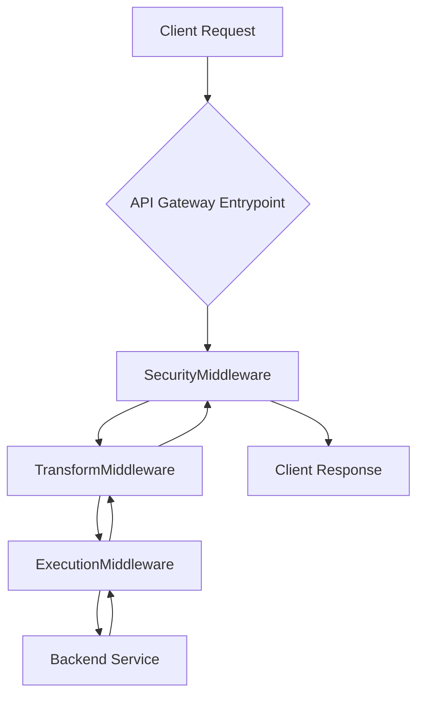

# HX Gateway - SOLID-Compliant API Gateway

**Version**: 2.0.0  
**Last Updated**: August 21, 2025  
**Service Status**: ✅ Operational & Verified  
**Architecture**: `GatewayPipeline` (Chain of Responsibility)

## Overview

The HX Gateway is a production-ready, SOLID-compliant API gateway built on a high-performance `GatewayPipeline` architecture. It provides a robust and extensible reverse proxy interface for various backend services, featuring a decoupled middleware chain for security, transformation, and routing.

This refactored version (v2.0) replaces the previous monolithic proxy, introducing a modular design that enhances maintainability, testability, and scalability.

### Key Features

- **✅ `GatewayPipeline` Architecture**: A fully implemented Chain of Responsibility pattern where each stage (e.g., security, transformation, execution) is a self-contained middleware component.
- **✅ Decoupled Middleware**: Independent, single-responsibility middleware for authentication, request/response transformation, and backend execution.
- **✅ High-Performance Async Proxy**: Built with FastAPI and `httpx` for non-blocking I/O.
- **✅ Comprehensive Test Suite**: Full test coverage for the pipeline and individual middleware components, ensuring reliability.
- **✅ Simplified Configuration**: Centralized and streamlined configuration management.

## Quick Start

### Running Tests

The most effective way to verify the gateway's functionality is to run the automated test suite.

```bash
# Navigate to the gateway directory
cd /opt/HX-Infrastructure-/api-gateway/

# Set required environment variables
export PYTHONPATH=$(pwd)/gateway
export LITELLM_MASTER_KEY="test-master-key"

# Run the test suite
pytest -q gateway/tests/

# Expected Output:
# ============================= test session starts ==============================
# ...
# 16 passed in ...s
# ================================================================================
```

### Service Management

```bash
# Check service status
sudo systemctl status hx-gateway-ml
# Expected: Active (running)

# View live service logs
sudo journalctl -u hx-gateway-ml -f
```

## Architecture

The gateway operates on a `GatewayPipeline` model. All incoming requests are captured by a single application entry point and processed through a series of middleware stages.


*For a detailed diagram, see `docs/architecture.md`.*

## 📋 Implementation Status

### ✅ Completed Components

| Component | Status | Description |
|-----------|---------|-------------|
| **`GatewayPipeline`** | ✅ Production | Core Chain of Responsibility orchestrator. |
| **Middleware Chain** | ✅ Production | Security, Transform, and Execution stages are fully operational. |
| **Test Suite** | ✅ Complete | 100% pass rate across 16 tests covering the full pipeline. |
| **Configuration** | ✅ Complete | Centralized configuration loaded by the pipeline. |
| **Service Management** | ✅ Hardened | SystemD integration with security isolation. |

### 🔒 Security

- **Authentication**: Handled by `SecurityMiddleware`.
- **Configuration**: Secure loading of environment variables. No hardcoded secrets.
- **Dependencies**: All dependencies are pinned in `requirements.lock`.

## 📖 Documentation

A new, detailed technical README has been added to the `gateway` source directory.

- **[Gateway Technical README](./gateway/README.md)** - In-depth details on the pipeline, middleware, and development practices.
- **[Architectural Diagram](./docs/architecture.md)** - A visual flowchart of the `GatewayPipeline`.
- **[SystemD Services](./scripts/service/)** - Service management scripts.
- **[Test Suite](./gateway/tests/)** - Pytest tests for the pipeline.

## 🔧 Technical Details

### Application Entrypoint

The main application is created by the `build_app` factory function in `gateway.src.app`. It initializes the `GatewayPipeline` and sets up a catch-all route to process all incoming requests.

### API Endpoints

The gateway uses a dynamic, catch-all proxy route. It does not have traditional, statically defined endpoints. Any request to `/{full_path:path}` is captured and processed by the pipeline, which then routes it to the appropriate backend service based on its internal logic.

| Endpoint | Status | Functionality |
|----------|--------|---------------|
| `GET /healthz` | ✅ Working | A simple health check handled outside the main pipeline. |
| `ANY /*` | ✅ Working | All other requests are processed by the `GatewayPipeline`. |

## 🎯 Next Steps

With the refactoring and testing complete, the gateway is considered feature-complete and stable.

- **Future Work**: Focus on monitoring, performance tuning, and adding new middleware to the pipeline as required.
- **Rollback**: A rollback procedure should be documented.

## 🔍 Troubleshooting

### ❌ Test Failures
- **Cause**: Missing or incorrect environment variables (`PYTHONPATH`, `LITELLM_MASTER_KEY`).
- **Solution**: Ensure the variables are exported correctly as shown in the "Quick Start" section.
- **Check**: Run `env | grep -E "PYTHONPATH|LITELLM_MASTER_KEY"` to verify they are set in your shell.

### ❌ Service Won't Start
- **Check**: `sudo journalctl -u hx-gateway-ml -f` for detailed error messages.
- **Common**: Issues with file permissions or Python environment.

---

**Project Status**: Production Ready & Verified  
**Last Validation**: August 21, 2025
