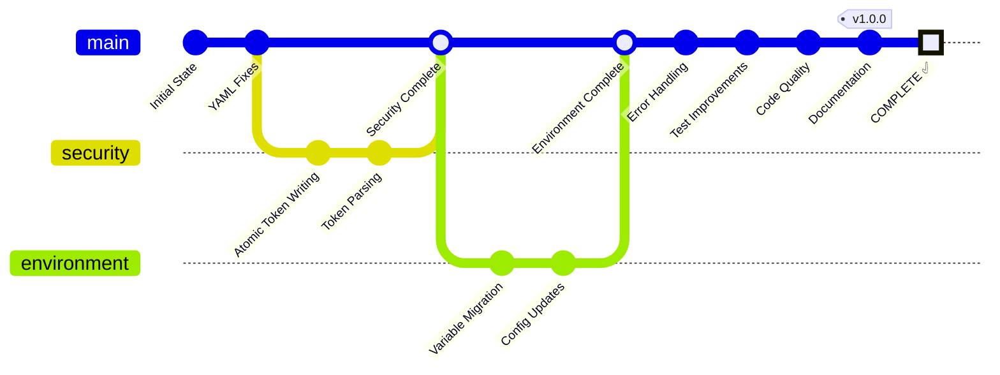

# HX Infrastructure Enhancement Completion Flowchart

This diagram visualizes the comprehensive enhancement workflow completed for the HX Infrastructure project, showing the progression through security improvements, environment configuration updates, error handling enhancements, and final documentation.

## Enhancement Summary

### Security Branch
- **Atomic Token Writing**: Optimized file synchronization in auth-token-manager.sh
- **Token Parsing**: Enhanced multi-line token extraction with robust validation

### Environment Branch  
- **Variable Migration**: Updated authentication patterns (MASTER_KEY → HX_MASTER_KEY)
- **Config Updates**: Replaced hardcoded IPs with environment variables

### Main Branch Improvements
- **Error Handling**: Fixed exit code capture and journalctl formatting consistency
- **Test Improvements**: Enhanced response validation in inference tests
- **Code Quality**: Comprehensive bash scripting best practices
- **Documentation**: Created detailed README files and configuration guides

### Final State: v1.0.0 ✅
All enhancements successfully integrated with comprehensive testing, documentation, and production-ready configurations.
